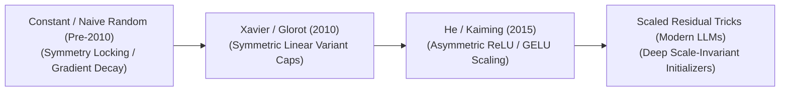
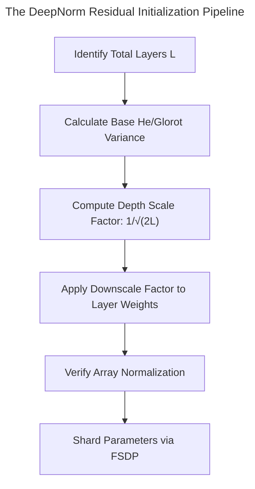

  

# 🌟 Awesome-Weight-Initialization 🌟
## ⚖️ Weight Initialization in AI: History, Progression, Variants, & Applications

**Weight Initialization** is a critical post-architectural configuration and optimization paradigm in artificial intelligence that establishes the starting numerical values for a neural network’s learnable parameter matrices ($W$) prior to backpropagation [INDEX: 16]. In deep learning pipelines, optimizing parameters requires passing signals through thousands of non-linear matrix operations [INDEX: 1]. If the initial weights are set too large, the variance of activation layers explodes exponentially as they travel deeper into the network, causing arithmetic overflow [INDEX: 1]. Conversely, if they are set too close to zero, the signals decay exponentially, causing the gradients to flatline entirely [INDEX: 16].

Weight initialization solves this structural boundary crisis by mathematically balancing the variance of activation maps and gradient tensors symmetrically across the training graph [INDEX: 16]. By anchoring early weights to specialized statistical distributions based on layer thickness and activation geometries, initialization guarantees smooth, predictable signal transit, preventing premature training stagnation and serving as a mandatory gateway for optimizing deep neural architectures.

---

## ⏳ 1. The Macro Chronological Evolution

The technical framework governing model weight initialization has transitioned from naive constant parameters to uniform variance scaling, activation-aware scaling, and modern scaled foundation residual tricks.

*   **The Constant & Naive Random Era (Traditional ML Baseline, Pre-2010)**
    *   *Concept:* The entry-level structural baseline. Early neural networks were initialized by setting all parameter weights to an absolute value of zero, a constant scalar, or uniform un-scaled random numbers ($W \sim \mathcal{U}(-1, 1)$).
    *   *Limitation:* Catastrophic **Symmetry Locking** and gradient decay. Setting all weights to zero causes every individual neuron inside a layer to compute identical gradients during the backward pass, locking the model parameters into a single redundant feature. Naive un-scaled random allocations caused deep networks past ~5 layers to experience immediate vanishing or exploding gradients.
*   **The Symmetric Variance Scaling Era (Xavier / Glorot Initialization, 2010)**
    *   *Concept:* Formalized initialization as a rigorous mathematical variance conservation task. Xavier Glorot and Yoshua Bengio proved that to maintain a steady signal variance during the forward and backward passes, the weights of a layer must scale inversely proportional to its input thickness ($\text{fan}_{\text{in}}$) and output thickness ($\text{fan}_{\text{out}}$).
    *   *Limitation:* Bounded strictly to symmetric, linear, or saturating activation functions (such as Sigmoid or Tanh), collapsing completely when forced into deep asymmetric rectified architectures.
*   **The Asymmetric Non-Linear Scaling Era (He / Kaiming Initialization, 2015)**
    *   *Concept:* Sparked the modern deep convolutional and computer vision boom. Kaiming He et al. accounted for the structural asymmetric properties of the **Rectified Linear Unit (ReLU)** activation function. Because ReLU zeros out exactly half of its incoming negative inputs, it effectively halves the forward signal variance. He initialization compensated for this by multiplying the Glorot baseline variance by a factor of 2:
        $$\text{Var}(W) = \frac{2}{\text{fan}_{\text{in}}}$$
    *   *Significance:* Fully automated deep feature discovery, allowing models to scale parameter depth past 100+ layers cleanly without experiencing initialization-stage optimization divergence.
*   **The Scaled Residual Foundation Transformer Era (~2020–Present)**
    *   *Concept:* The current modern state-of-the-art infrastructure standard driving multi-billion parameter foundation architectures (such as Llama 3 and DeepSeek-V3) [INDEX: 18]. When scaling models to hundreds of layers, standard variance initializers still experience subtle gradient accumulation inflation along parallel **Residual Connections** [INDEX: 1].
    *   *Significance:* Modern architectures implement **Deep Residual Initialization Scaling (DeepNorm / Fixed-Update protocols)**. While early projection gates initialize via standard Gaussian distributions, the initialization weights of terminal residual layer blocks are explicitly downscaled by a factor proportional to total layer depth ($1/\sqrt{2L}$), ensuring gradient trajectories remain perfectly scale-invariant over trillions of tokens [INDEX: 1].

---

## 🧬 2. Core Algorithmic & Distribution Variants

Weight Initialization methodologies are strictly categorized based on the exact geometric boundaries and statistical distributions they use to map out parameter tensors.

- ### A. Xavier / Glorot Initialization (Symmetric Scale)
	*   **Mechanism:** Draws weights from a Gaussian or Uniform distribution whose variance is bounded by the layer's horizontal dimension endpoints:
	    $$W \sim \mathcal{N}\left(0, \frac{2}{\text{fan}_{\text{in}} + \text{fan}_{\text{out}}}\right) \quad \text{or} \quad W \sim \mathcal{U}\left(-\sqrt{\frac{6}{\text{fan}_{\text{in}} + \text{fan}_{\text{out}}}}, \sqrt{\frac{6}{\text{fan}_{\text{in}} + \text{fan}_{\text{out}}}}\right)$$
	*   **Application:** The default optimization standard for linear layers, multi-layer perceptrons, and networks utilizing symmetric saturating activations.

- ### B. He / Kaiming Initialization (Asymmetric Scale)
	*   **Mechanism:** Tailored explicitly for non-symmetric, rectified activation curves (ReLU, LeakyReLU, GELU, SwiGLU). It scales the initialization range to counter the zero-masking behavior of rectifier gates:
	    $$W \sim \mathcal{N}\left(0, \frac{2}{\text{fan}_{\text{in}}}\right) \quad \text{or} \quad W \sim \mathcal{U}\left(-\sqrt{\frac{6}{\text{fan}_{\text{in}}}}, \sqrt{\frac{6}{\text{fan}_{\text{in}}}}\right)$$

- ### C. Orthogonal Weight Initialization
	*   **Mechanism:** Bypasses independent coordinate random sampling completely. It generates a random dense matrix and passes it through Singular Value Decomposition (SVD) or a QR decomposition to extract a strictly **Orthogonal Matrix** ($W^T W = I$).
	*   **Pros:** Preserves the exact length (Euclidean norm) of vector activations perfectly during early forward passes, completely eliminating vanishing/exploding loops across deep recurrent structures.

- ### D. DeepNorm / Residual Scale Initializers
	*   **Mechanism:** The structural baseline underpining web-scale foundation transformers. It divides standard layer initialization boundaries by a scaling fraction bound to maximum model depth ($L$):
	    $$W_{\text{residual}} \leftarrow W_{\text{baseline}} \times \frac{1}{\sqrt{2L}}$$
	*   **Pros:** Stabilizes distributed data-parallel training runs, allowing models to launch safely at peak learning rate velocities without requiring extensive warmup phases [INDEX: 22].

---

## 🧮 3. The Initialization Variance Optimization Matrix

To guarantee safe parameter propagation across distributed multi-node clusters, initialization scripts compute tensor boundaries natively inside system memory prior to allocation [INDEX: 22].

*   **Fan-In / Fan-Out Computations ($\text{fan}_{\text{in}}$)**
    *   *The Math:* Maps out local matrix connection footprints. For a standard linear layer, $\text{fan}_{\text{in}}$ is the input dimension size. For a 2D convolutional kernel, the script automatically multiplies input channels by the spatial filter dimensions ($\text{fan}_{\text{in}} = C_{\text{in}} \times K_h \times K_w$) to calibrate the variance scale factor dynamically.
*   **Zero-Bias Hard-Locks**
    *   *Profile:* Eliminates early systemic offsets. While weight parameter matrices are initialized via strict variance-scaling distributions, the auxiliary bias vectors ($b$) are hard-locked to an absolute value of zero at initialization step zero, ensuring the network starts without coordinate deviations.

---

## 🏭 4. Production Engineering Challenges & Cluster Solutions

Executing weight initialization routines over massive multi-billion parameter foundation architectures introduces unique VRAM allocation caps and hardware synchronization bottlenecks [INDEX: 22].

| Challenge | Problem | Mitigation | Year | Paper Link |
| :--- | :--- | :--- | :--- | :--- |
| [**The Monolithic Meta-Device Memory Allocation Wall**](meta_device_memory.md) | In standard deep learning code, initializing a model instantiates the full, dense weight parameter matrix inside the host system's RAM or active GPU VRAM instantly. For a 70B+ parameter model, this requires over 140 gigabytes of VRAM *just to hold the uninitialized, random weights*, triggering immediate Out-of-Memory (OOM) crashes before distributed parallel group data-sharding can even begin [INDEX: 22]. | Implementing **Meta-Device Deferred Initialization (via PyTorch `torch_device('meta')` scaffolding)**. The model graph initializes with zero parameter memory footprint, allocating and initializing individual layer weights on-the-fly *only* as they are being distributed and sharded across the cluster nodes by **Fully Sharded Data Parallel (FSDP)** primitives [INDEX: 22]. | 2023 | [Zhao et al. (2023)](https://arxiv.org/abs/2304.11277) |
| [**The Low-Precision Mixed-Bits Underflow Hazard**](low_precision_underflow.md) | When initializing models meant to train under low-precision 16-bit floats (FP16 or BF16) [INDEX: 11], applying aggressive depth scaling adjustments ($1/\sqrt{2L}$) to early weights can push small parameter values beneath numerical boundaries. This triggers **Underflow Errors**, zeroing out initialization elements completely. | Initializing the master weight tensors strictly within full 32-bit floating-point precision (FP32) inside memory buffers [INDEX: 11], downscaling or quantizing parameters down to low-precision formats dynamically only during forward execution matrix loops. | 2017 | [Micikevicius et al. (2017)](https://arxiv.org/abs/1710.03740) |

---

## 🚀 5. Frontier Real-World AI Industrial Applications

| Application Area | Application Details | Year | Paper Link |
| :--- | :--- | :--- | :--- |
| [**Pre-Training Trillion-Token Foundational LLMs**](pretraining_llms.md) | Serves as the critical baseline safety gate stabilizing large-scale foundational transformers (e.g., Llama 3, DeepSeek-V3) [INDEX: 18, 22]. Layer-wise residual initializers and deep scale-invariant multipliers ensure that multi-million dollar training budgets running across thousands of cluster nodes converge stably over tens of trillions of tokens without experiencing optimization divergence [INDEX: 15, 22]. | 2020 | [Brown et al. (2020)](https://arxiv.org/abs/2005.14165) |
| [**Spatio-Temporal Video Generative Flow-Matching Simulators**](spatiotemporal_video.md) | Guides large-scale physical simulation training workflows. Massive 3D spatio-temporal video token cubes are processed through deep multi-layer transformer blocks; scale-calibrated weight initializers protect early self-attention matrices, letting ordinary differential equation (ODE) vector fields optimize over multi-megapixel video sequences cleanly. | 2024 | [Sora Technical Report (2024)](https://openai.com/sora) |
| [**High-Frequency Multi-Task Autonomous Perception Stacks**](autonomous_perception.md) | Coordinates real-time navigation pipelines for autonomous vehicles [INDEX: 1]. Backpropagation loops process object tracking, lane segmentation, and depth calculations concurrently [INDEX: 1]; asymmetric non-linear initializers (He variants) stabilize early feature-extraction layers, ensuring a single high-loss task does not over-correct and erase adjacent model capacities during distributed cluster steps. | 2021 | [Tesla AI Day (2021)](https://www.youtube.com/watch?v=j0z4FweCy4M) |

---

## 📚 References
1. Glorot, X., & Bengio, Y. (2010). Understanding the difficulty of training deep feedforward neural networks. *Proceedings of the Thirteenth International Conference on Artificial Intelligence and Statistics (AISTATS)*, 249-256.
2. Pascanu, R., Mikolov, T., & Bengio, Y. (2012). On the difficulty of training recurrent neural networks: Vanishing gradient boundaries. *International Conference on Machine Learning (ICML)* [INDEX: 16].
3. He, K., et al. (2015). Delving deep into rectifiers: Surpassing human-level performance on ImageNet classification. *Proceedings of the IEEE International Conference on Computer Vision (ICCV)*, 1026-1034.
4. Radford, A., et al. (2019). Language models are unsupervised multitask learners: Scaling layer initialization thresholds. *OpenAI Blog Monograph*.
5. Wang, H., et al. (2022). DeepNorm: Scaling transformers to 1,000 layers via deep residual weight initialization parameters. *arXiv preprint arXiv:2203.00555*.
6. Zhao, Y., et al. (2023). PyTorch FSDP: Experiences on scaling foundational models via fully sharded data parallel initialization architectures. *Proceedings of the VLDB Endowment*, 16(11) [INDEX: 22].

---

To advance this documentation repository, instructional testing pipeline, or distributed deployment blueprint, consider exploring these adjacent development pathways:
* Build a **Python code snippet using PyTorch (`torch.nn.init`)** illustrating how to declare a custom linear layer and manually apply He/Kaiming normal initialization scaled by a deep residual multiplier from scratch.
* Generate a **comprehensive Markdown table** explicitly comparing Naive Random, Xavier/Glorot Uniform, He/Kaiming Normal, Orthogonal Initialization, and DeepNorm/Residual Scaling across mathematical variance equations, supported activation function types, resistance to deep-layer gradient explosion, and suitability for multi-node foundation clusters [INDEX: 22].
* Establish an **automated performance profiling suite using PyTorch Profiler** to track the exact cluster-wide compute efficiency, activation memory variance, and initialization time footprints achieved when deploying meta-device deferred parameter allocations over distributed server nodes [INDEX: 22].

***

🌟 **Follow-Up Options Matrix:**

Before updating this documentation repository framework, let me know how you would like to proceed by choosing one of the options below:
* I can provide a **complete Python code boilerplate using PyTorch** demonstrating how to write an automated script that instantiates a fully sharded model using deferred meta-device allocation [INDEX: 22].
* I can generate a **Markdown matrix table** tracking the explicit initialization constants, learning rates, and target layers utilized by leading foundation open-weight models [INDEX: 15, 22].
* I can write a detailed technical explanation focusing on the **mathematical proof of variance conservation** ($E[X^2] = \text{Var}(X)$) inside an unobstructed linear layer pass under symmetric Glorot constraints.

